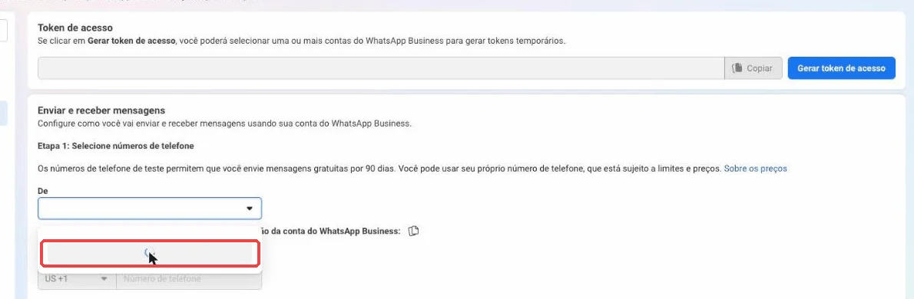
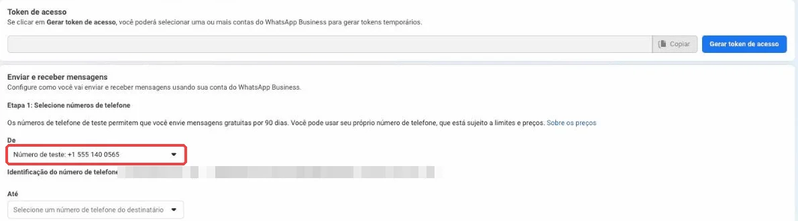
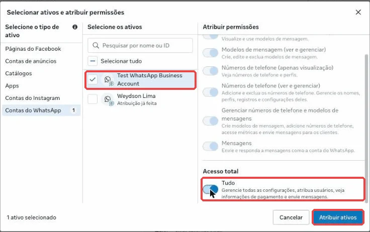

# Guia — Conectar o WhatsApp Oficial (cliente sem Embedded Signup)

> Fonte de verdade dos passos: `src/features/campanhas/lib/whatsapp-connect-guide.json` (este documento espelha o JSON). Spec: [0040](../specs/campanhas/0040-disparo-em-massa-self-service.md).

## Como funciona

- O assistente **Campanhas → Conectar número oficial** mostra **um passo por tela**: print da Meta com **seta vermelha animada** no botão, instrução curta e link direto. O Astro comemora cada fase com um balão.
- O cliente só faz na Meta o que é impossível por API: criar o app, usuário do sistema, gerar a chave e cadastrar o cartão.
- Cada chave é colada **no passo em que é copiada** (29: chave de acesso; 32: ID e chave secreta) e fica salva cifrada no banco (`WhatsAppConnectProgress`); o passo 33 já abre com as **3 chaves** (chave de acesso, ID do app, chave secreta). A ÓRBITA confere na Meta (`debug_token`), descobre a conta WhatsApp, grava cifrado no funil (aparece preenchido em Configurações → Integrações) e liga o webhook sozinha.
- Passos marcados **(ÓRBITA faz)** ficam escondidos; aparecem só em "Prefiro fazer tudo na Meta" (plano B).
- URL de callback: `https://orbita.nasaex.com/api/chat/webhook/official` (env `META_WEBHOOK_CALLBACK_URL`). A Meta **só aceita HTTPS**. Verify token: `META_VERIFY_TOKEN_GLOBAL`.
- O app precisa estar **publicado (Ao vivo)** para a Meta entregar as respostas dos clientes (passo 41).

## Links diretos para o app do cliente

No passo 7 (painel do app) o cliente cola o endereço da página. A ÓRBITA extrai `/apps/<ID do app>/` e `business_id=<portfólio>` e, a partir daí, cada botão abre **no app e no portfólio dele** (`guideStepLink` em `whatsapp-connect-guide.ts`, campo `linkKey` de cada passo): painel, casos de uso, configuração da API, webhook (`/whatsapp-business/wa-settings/`), configurações básicas, contas do WhatsApp, usuários do sistema e telefones do Gerenciador. O ID do app já chega preenchido no passo das chaves.

Links conferidos no navegador (2026-09-28):

| Tela | Sem os IDs | Com os IDs |
|---|---|---|
| Painel, configuração da API, início rápido, webhook, configurações básicas | cai em "Meus apps" (cliente escolhe o app) | abre no app certo |
| Casos de uso (`/use_cases/`) | — | em apps da interface antiga cai no Painel |
| Contas do WhatsApp, telefones do Gerenciador | abre no último portfólio usado | abre no portfólio certo |
| Usuários do sistema | **quebra** ("conteúdo não disponível") — por isso o botão abre as Configurações do portfólio (`/latest/settings/`) e o passo "Crie um usuário do sistema" tem um campo para colar o link da página, que grava o `business_id` | abre direto |

## Progresso salvo

Passo atual, etapas feitas, origem do número e balões do Astro já exibidos ficam em `WhatsAppConnectProgress` (um por funil). Procedures: `campanhas.connectProgress`, `campanhas.saveConnectProgress`, `campanhas.saveKeyDraft`. Os rascunhos das chaves são apagados assim que a ÓRBITA confere e grava na instância.

## Passos

| # | Fase | Passo | O que o cliente faz | Print |
|---|---|---|---|---|
| 1 | Criar seu app na Meta | Você já tem um app na Meta? | Abra developers.facebook.com → Meus apps. Se já existe um app da sua empresa com o WhatsApp, use esse app. Se a lista estiver vazia, crie um novo. [link](https://developers.facebook.com/apps/) Botões: **Já tenho** (pula para "painel") / **Não, vou criar**. ⚠️ O app já é usado por outro sistema (outro CRM ou chatbot)? Crie um app novo só para a ÓRBITA: trocar o webhook de um app em uso desliga o outro sistema. | — |
| 2 | Criar seu app na Meta | Dê um nome ao seu app | Em developers.facebook.com, clique em Criar aplicativo. Escreva um nome (ex.: WhatsApp da sua loja), confira o e-mail e clique em Avançar. [link](https://developers.facebook.com/apps/creation/) | `02-criar-app.webp` (origem `1.jpeg`) |
| 3 | Criar seu app na Meta | Escolha o WhatsApp | Marque Conectar-se com clientes pelo WhatsApp e clique em Avançar. | `03-caso-de-uso.webp` (origem `2.jpeg`) |
| 4 | Criar seu app na Meta | Escolha a sua empresa | Marque o portfólio da sua empresa (é o cadastro dela na Meta) e clique em Avançar. ⚠️ Não tem portfólio? Clique em "Crie um portfólio empresarial" e use o nome da sua empresa. | `04-portfolio.webp` (origem `3.jpeg`) |
| 5 | Criar seu app na Meta | Requisitos | Nesta tela não há nada para fazer. Clique em Avançar. | `05-requisitos.webp` (origem `4.jpeg`) |
| 6 | Criar seu app na Meta | Confira e crie | Confira o resumo e clique em Criar aplicativo. | `06-criar-aplicativo.webp` (origem `5.jpeg`) |
| 7 | Criar seu app na Meta | Confirme sua senha | A Meta pede sua senha do Facebook por segurança. Digite a senha e clique em Enviar. | `07-senha.webp` (origem `6.jpeg`) |
| 8 | Ligar o WhatsApp no app | Abra o WhatsApp do app | No painel do app, clique em Personalizar o caso de uso "Conectar-se com os clientes pelo WhatsApp". Antes, copie o endereço desta página (barra do navegador) e cole abaixo: assim cada botão daqui pra frente abre direto no seu app. | `08-painel.webp` (origem `7.jpeg`) |
| 9 | Ligar o WhatsApp no app | Personalizar | Se abrir a lista de casos de uso, clique em Personalizar. | `09-personalizar.webp` (origem `8.jpeg`) |
| 10 | Ligar o WhatsApp no app | Comece a usar a API | Clique em Começar a usar a API. | `10-comecar-api.webp` (origem `9.jpeg`) |
| 11 | Ligar o WhatsApp no app | Sua conta do WhatsApp | Você já tem uma conta do WhatsApp Business da API com o número que vai usar para disparar? Não contam: a "Test WhatsApp Business Account" (a Meta cria sozinha, é só de teste) e contas marcadas como "Aplicativo WhatsApp Business" (é o WhatsApp do celular). Botões: **Já tenho** (pula para "tem-usuario-sistema") / **Ainda não, vou criar**. ⚠️ Só quer testar antes de ter o número da empresa? No app, em Configuração da API, abra a lista "De" e clique em "Obter novo número de teste": a Meta cria uma conta de teste grátis (envia só para até 5 números cadastrados). | — |
| 12 | Ligar o WhatsApp no app | Crie a conta da sua empresa | Em Contas do WhatsApp, clique em + Adicionar → Crie uma nova conta do WhatsApp Business. | `12-nova-conta-adicionar.webp` (origem `wa-nova-conta-menu.png`) |
| 13 | Ligar o WhatsApp no app | Nome e categoria | Confira o nome de exibição (igual ao nome da empresa), escolha a Categoria, marque Não sou um robô e clique em Continuar. | `13-nova-conta-detalhes.webp` (origem `wa-nova-conta-detalhes.png`) |
| 14 | Ligar o WhatsApp no app | Número e código | Digite o número novo com DDD, escolha SMS, clique em Avançar e digite o código que chegar. Pronto: a conta aparece em Contas do WhatsApp, já com o seu número. ⚠️ A Meta diz que o número já está em uso? Ele ainda está no aplicativo do WhatsApp ou em outro provedor. No celular, apague a conta do WhatsApp desse número (Configurações → Conta → Apagar conta) ou peça ao provedor antigo para liberar, e tente de novo. | `14-nova-conta-telefone.webp` (origem `13.jpeg`) |
| 15 | Seu número (a ÓRBITA faz) | Tela da API **(ÓRBITA faz)** | Aqui a Meta mostra o número de teste. A ÓRBITA cadastra o seu número de verdade por você — só faça pela Meta se a equipe pedir. | `15-configuracao-api.webp` (origem `10.jpeg`) |
| 16 | Seu número (a ÓRBITA faz) | Adicionar telefone **(ÓRBITA faz)** | Pela Meta: abra a lista De e clique em + Adicionar telefone. | `16-adicionar-telefone.webp` (origem `11.jpeg`) |
| 17 | Seu número (a ÓRBITA faz) | Perfil do WhatsApp Business **(ÓRBITA faz)** | Pela Meta: escreva o nome que os clientes vão ver (igual ao nome da empresa), fuso horário e categoria. Avançar. | `17-perfil.webp` (origem `12.jpeg`) |
| 18 | Seu número (a ÓRBITA faz) | Número e código **(ÓRBITA faz)** | Pela Meta: digite o número com DDD, escolha SMS e clique em Avançar. Depois digite o código que chegar. | `18-numero-sms.webp` (origem `13.jpeg`) |
| 19 | Seu número (a ÓRBITA faz) | IDs do número **(ÓRBITA faz)** | Pela Meta: estes são os IDs do número e da conta. A ÓRBITA descobre os dois sozinha pela sua chave. | `19-ids.webp` (origem `14.jpeg`) |
| 20 | Cartão na Meta | Falta o cartão | A Meta avisa que falta uma forma de pagamento. Clique em Adicionar forma de pagamento. | `20-aviso-pagamento.webp` (origem `15.jpeg`) |
| 21 | Cartão na Meta | Cadastre o cartão da empresa | Abra Contas do WhatsApp, escolha a sua conta e clique em Configurações de pagamento (no fim da página). [link](https://business.facebook.com/latest/settings/whatsapp_account) | `21-contas-whatsapp.webp` (origem `16.jpeg`) |
| 22 | Cartão na Meta | Adicionar forma de pagamento | Na página de cobrança da sua conta do WhatsApp, clique em Adicionar forma de pagamento. | `22-pagamento-adicionar.webp` (origem `wa-pagamento-adicionar.png`) |
| 23 | Cartão na Meta | País, moeda e fuso | Confira Brasil e Real brasileiro e troque o fuso para São Paulo (GMT-03:00) — a Meta sugere Los Angeles. Isso não pode ser mudado depois. Clique em Avançar e preencha os dados do cartão da empresa (a ÓRBITA não vê nem guarda esses dados). ⚠️ Atenção: país, moeda e fuso ficam fixos para sempre nesta conta. Se errar, só criando outra conta do WhatsApp. | `23-pagamento-fuso.webp` (origem `wa-pagamento-fuso.png`) |
| 24 | Chave de acesso permanente | Você já tem um usuário do sistema? | Abra Usuários → Usuários do sistema. Se já aparece alguém na lista (ex.: ORBITA), use esse — enquanto a empresa não for verificada, a Meta só deixa ter 1. [link](https://business.facebook.com/latest/settings/) Botões: **Já tenho** (pula para "atribuir-ativos") / **Não, vou criar**. ⚠️ Não aparece "Usuários do sistema" no menu? Você precisa ser administrador do portfólio. Peça para quem administra liberar o seu acesso (Pessoas → Acesso total). | `24-tem-usuario-sistema.webp` (origem `17.jpeg`) |
| 25 | Chave de acesso permanente | Crie um usuário do sistema | No menu da esquerda, abra Usuários → Usuários do sistema e clique em + Adicionar. É um "robô" da sua empresa que mantém a conexão ativa sem depender do seu login. [link](https://business.facebook.com/latest/settings/) ⚠️ Apareceu "atingiu o número máximo de usuários administradores"? Você já tem um usuário do sistema — não precisa criar outro. Clique em Cancelar, escolha o usuário que já está na lista e vá para "Dê acesso ao app e ao WhatsApp". | `25-usuarios-sistema.webp` (origem `17.jpeg`) |
| 26 | Chave de acesso permanente | Nome do usuário do sistema | Escreva um nome (ex.: orbita). | `26-nome-usuario-sistema.webp` (origem `18.jpeg`) |
| 27 | Chave de acesso permanente | Função Admin | Em função escolha Admin e clique em Create system user. ⚠️ Apareceu "atingiu o número máximo de usuários administradores"? Você já tem um usuário do sistema — não precisa criar outro. Clique em Cancelar, escolha o usuário que já está na lista e vá para "Dê acesso ao app e ao WhatsApp". | `27-funcao-admin.webp` (origem `19.jpeg`) |
| 28 | Chave de acesso permanente | Dê acesso ao app e ao WhatsApp | Na lista de Usuários do sistema, clique no seu usuário (ex.: ORBITA). No lado direito, clique em ⋯ (ao lado de Anular tokens) → Atribuir ativos. ⚠️ Se o usuário ainda não tem nenhum ativo, o botão Atribuir ativos aparece também no meio da tela — pode usar qualquer um dos dois. | `28-atribuir-ativos.webp` (origem `wa-atribuir-ativos-menu.png`) |
| 29 | Chave de acesso permanente | Acesso à conta do WhatsApp | Na coluna da esquerda, clique em Contas do WhatsApp (não mexa nas outras abas). Marque a conta com o nome da sua empresa (não a "Test WhatsApp Business Account"), ligue Acesso total → Tudo e clique em Atribuir ativos → Concluir. ⚠️ Apareceu "Tem certeza? Algumas das permissões serão removidas"? Clique em Não, voltar: você mexeu sem querer em outro ativo (ex.: sua Página do Facebook). Feche a janela no X, abra de novo em ⋯ → Atribuir ativos e mexa só em Contas do WhatsApp. | `29-atribuir-whatsapp.webp` (origem `21.jpeg`) |
| 30 | Chave de acesso permanente | Dê acesso ao app | Abra de novo ⋯ → Atribuir ativos. Na coluna da esquerda, clique em Apps. | `30-atribuir-app.webp` (origem `25.jpeg`) |
| 31 | Chave de acesso permanente | App com acesso total | Marque o app que você criou no passo 1, ligue Gerenciar app e clique em Atribuir ativos → Concluir. | `31-app-gerenciar.webp` (origem `26.jpeg`) |
| 32 | Chave de acesso permanente | Conta liberada: gere a chave | Pronto: o usuário agora aparece com o app e a conta do WhatsApp com Acesso total. Espere uns segundos e clique em Gerar token (no alto, ao lado de Anular tokens). ⚠️ Nunca clique em "Anular tokens": isso desliga todas as chaves desse usuário, inclusive as de outros sistemas. | `32-whatsapp-atribuido.webp` (origem `wa-app-e-whatsapp-liberados.png`) |
| 33 | Chave de acesso permanente | Gerar a chave: escolha o app | Na janela que abriu, escolha o app que você criou no passo 1 e clique em Avançar. | `33-gerar-token-app.webp` (origem `23.jpeg`) |
| 34 | Chave de acesso permanente | Validade: Nunca | Marque Nunca (assim a conexão não cai) e clique em Avançar. | `34-token-nunca.webp` (origem `24.jpeg`) |
| 35 | Chave de acesso permanente | Permissões | Abra a lista Selecionar permissões e marque whatsapp_business_management e whatsapp_business_messaging. Clique em Gerar token. ⚠️ Apareceu "Nenhuma permissão disponível"? O app ainda não foi liberado para o usuário do sistema (passo "Dê acesso ao app") ou a Meta ainda está processando: feche no X, espere 1 minuto e gere o token de novo. | `35-token-permissoes.webp` (origem `wa-token-permissoes.png`) |
| 36 | Chave de acesso permanente | Copie a chave | A Meta mostra a chave uma única vez. Clique em Copiar e cole no campo abaixo — a ÓRBITA guarda na hora, você não precisa voltar aqui. | `36-token-copiar.webp` (origem `29.jpeg`) |
| 37 | Suas chaves do app | Onde as chaves ficam no funil **(ÓRBITA faz)** | As chaves ficam em Configurações do funil → Integrações. Você não precisa preencher aqui: a ÓRBITA preenche sozinha quando você cola no passo seguinte. | `37-funil-integracoes.webp` (origem `30 - Tracking > configurações > integrações.jpeg`) |
| 38 | Suas chaves do app | Abra as configurações do app | No painel do app na Meta, abra Configurações do app → Básico. [link](https://developers.facebook.com/apps/) | `38-menu-basico.webp` (origem `31.jpeg`) |
| 39 | Suas chaves do app | Copie o ID e a chave secreta | Copie o ID do Aplicativo e cole abaixo. Em Chave Secreta do Aplicativo clique em Mostrar, confirme a senha, copie e cole abaixo. | `39-id-e-chave-secreta.webp` (origem `32.jpeg`) |
| 40 | Suas chaves do app | Confira suas 3 chaves | As chaves que você colou nos passos anteriores já estão aqui. Clique em Conferir e salvar: a ÓRBITA confere tudo na Meta e preenche as configurações do seu funil sozinha. ⚠️ Liberou uma conta do WhatsApp depois de gerar a chave? Gere a chave de novo e troque aqui: a Meta só inclui na chave as contas liberadas até aquele momento. | — |
| 41 | Suas chaves do app | Funil preenchido **(ÓRBITA faz)** | Pronto: é assim que as chaves aparecem no funil depois que a ÓRBITA preenche. Nada a fazer aqui. | `41-funil-preenchido.webp` (origem `32.1.jpeg`) |
| 42 | Seu número (a ÓRBITA faz) | Nome em análise | No Gerenciador do WhatsApp o nome de exibição aparece Em análise. A Meta aprova em até 2 dias — você já pode testar enquanto isso. [link](https://business.facebook.com/latest/whatsapp_manager/phone_numbers) | `42-nome-em-analise.webp` (origem `33.jpeg`) |
| 43 | Seu número (a ÓRBITA faz) | IDs do número **(ÓRBITA faz)** | Pela Meta: aqui ficam o ID do número e da conta. A ÓRBITA descobre os dois sozinha pela sua chave. | `43-ids-numero.webp` (origem `34.jpeg`) |
| 44 | Receber mensagens no chat | Abra a tela do Webhook | No seu app, abra Casos de uso → Personalizar → Configuração. É lá que a Meta pergunta para onde mandar as mensagens dos seus clientes. ⚠️ O campo URL de callback já está preenchido com outro endereço? Ele é de outro sistema. Não troque: fale com a equipe da ÓRBITA pelo botão "Pedir ajuda". | `44-webhook-vazio.webp` (origem `35.jpeg`) |
| 45 | Receber mensagens no chat | Cole a URL e o token | Copie os dois campos abaixo e cole na Meta nos campos de mesmo nome: URL de callback e Verificar token. Depois clique em Verificar e salvar. ⚠️ Use exatamente o token mostrado aqui: ele é só deste funil. A URL precisa começar com https:// — com http:// a Meta recusa. | `45-webhook-callback.webp` (origem `36.jpeg`) |
| 46 | Receber mensagens no chat | Campos do webhook | Depois de salvar, aparece a lista Campos do webhook. Role a página até a linha messages. | `46-webhook-campos.webp` (origem `37.jpeg`) |
| 47 | Receber mensagens no chat | Assine "messages" | Na linha messages, ligue a chave Assinar (fica azul, escrito Assinado). Pronto: as mensagens dos clientes passam a chegar no chat deste funil. | `47-webhook-messages.webp` (origem `38.jpeg`) |
| 48 | Publicar e conferir | Publique o app | Em Configurações do app → Básico, preencha a URL da política de privacidade do seu site e a categoria. Depois clique em Publicar no menu. Sem publicar, a Meta não entrega as respostas dos clientes. | — |
| 49 | Publicar e conferir | Confira na ÓRBITA | Volte aqui e clique em Conferir conexão. Tudo verde? Seu WhatsApp oficial está pronto para disparar. | — |

## Caminho de teste (sem número próprio)

Para testar o disparo antes de ter um número da empresa. Feito e fotografado em 2026-09-28 no app "APP TESTE ÓRBITA - 28.09".

1. **Criar a conta e o número de teste.** No app: Casos de uso → Personalizar → **Configuração da API**. Na lista **De**, clique em **Obter novo número de teste**. A Meta cria sozinha uma "Test WhatsApp Business Account" com um número americano gratuito (90 dias; envia só para até 5 números cadastrados em **Até**).

   

   

2. **Liberar a conta para o usuário do sistema.** Usuários do sistema → seu usuário → ⋯ → Atribuir ativos → Contas do WhatsApp → marque **Test WhatsApp Business Account** → **Acesso total → Tudo** → Atribuir ativos → Concluir.

   

3. **Gerar a chave de novo.** A Meta grava na chave as contas liberadas **no momento em que ela é gerada**: conta liberada depois não aparece na chave antiga (a ÓRBITA responde "A chave não enxerga nenhuma conta do WhatsApp da API"). Gere outra chave (app → Nunca → `whatsapp_business_management` + `whatsapp_business_messaging`) e troque no passo "Copie a chave".

### Armadilhas encontradas no teste

| Sintoma | Causa | Saída |
|---|---|---|
| "Nenhuma permissão disponível" ao gerar a chave | App não liberado ao usuário do sistema, ou liberado há segundos | Liberar o app (Gerenciar app) e esperar ~1 min |
| "A chave não enxerga nenhuma conta do WhatsApp da API" | Só existe conta "Aplicativo WhatsApp Business" (a do celular), ou a conta foi liberada depois da chave | Criar a conta da empresa (ou o número de teste), liberar e gerar a chave de novo |
| "Atingiu o número máximo de usuários administradores" | Portfólio não verificado só aceita 1 usuário do sistema Admin | Usar o usuário que já existe |
| "Tem certeza? Algumas permissões serão removidas" | Clique sem querer em outro ativo (ex.: Página) na janela Atribuir ativos | Não, voltar; reabrir e mexer só em Contas do WhatsApp |
| "A chave não enxerga nenhuma conta" mesmo com a conta liberada | Chave de usuário do sistema vale para **todas** as contas liberadas: a Meta não manda `target_ids` e listar as contas exige `business_management`, que o app não oferece | A ÓRBITA pede o **ID da conta do WhatsApp Business** (Configuração da API → Identificação da conta) e confere direto com `GET /{waba}` |
| "Internal server error" ao salvar a chave (ambiente local) | `AI_SECRETS_KEY` ausente no servidor | Definir a variável; em produção conferir no Coolify |

## Prints

- Cada print é **recortado** na área útil (`shot.crop`); a seta é recalculada sobre o recorte.
- Ficam em `public/guides/whatsapp-oficial/NN-slug.webp`, gerados por `python3 scripts/guides/prepare-whatsapp-guide.py <pasta-dos-prints>`. O stepper, o print com seta e o checklist moram em `src/features/meta-guide/` desde a spec 0047 e são compartilhados com o guia do Instagram do COMMENTS; o WhatsApp passa a sua definição (`WHATSAPP_GUIDE`).
- O script **pixeliza** foto, nome, e-mail, portfólios de outros clientes, chaves e tokens (retângulos `redact` do JSON) e troca fotos por avatar neutro. A seta vermelha **não** é queimada na imagem: é desenhada na tela pelo `target` do JSON (`src/features/meta-guide/components/guide-shot.tsx`), então dá para ajustar sem editar imagem.
- Os originais (`1.jpeg` … `38.jpeg`, `32.1.jpeg`) vêm da equipe; o campo `source` de cada passo aponta o arquivo. Rodar: `python3 scripts/guides/prepare-whatsapp-guide.py ~/Downloads`.
- **Segurança:** os prints originais mostram token e chave secreta do app de teste — redefina a chave secreta e anule os tokens depois de usar.

## Bifurcações: de onde o cliente pode partir

O cliente nem sempre começa do zero. Cada estado abaixo tem um caminho no guia (pergunta com "Já tenho" que pula passos, aviso amarelo no passo, ou tratamento automático na ÓRBITA).

| Estado de partida | Risco se seguir "no instinto" | Como o guia trata |
|---|---|---|
| Já tem **app** na Meta | Criar um segundo app e se perder entre eles | Pergunta "Você já tem um app na Meta?" (passo 1) → "Já tenho" pula para o painel do app, onde ele cola o link |
| App já usado por **outro sistema** (outro CRM/chatbot) | Trocar o webhook desliga o outro sistema | Aviso no passo 1 e no passo do webhook: criar um app só para a ÓRBITA / pedir ajuda |
| Sem **portfólio empresarial** | Travar na escolha de empresa | Aviso no passo "Escolha a sua empresa": "Crie um portfólio empresarial" |
| Já tem **conta do WhatsApp da API** | Criar conta duplicada | Pergunta "Sua conta do WhatsApp" → "Já tenho" pula a criação |
| Só tem conta **"Aplicativo WhatsApp Business"** (a do celular) ou a **conta de teste** | Achar que já tem conta; chave não enxerga nada | Texto da pergunta explica que não contam; erro claro no passo das chaves |
| Número **ainda no app do WhatsApp** ou em **outro provedor** | "Número já em uso" ao cadastrar | Aviso no passo "Número e código" (apagar a conta no celular ou pedir liberação ao provedor) e alerta na etapa Número |
| Já tem **usuário do sistema** | Tentar criar outro → "máximo de administradores" | Pergunta "Você já tem um usuário do sistema?" → "Já tenho" pula para dar acesso |
| **Não é administrador** do portfólio | Não acha "Usuários do sistema" | Aviso no passo da pergunta: pedir acesso total a quem administra |
| Chave antiga de **outro sistema** | Clicar em "Anular tokens" e derrubar tudo | Aviso: nunca clicar em "Anular tokens" |
| Conta liberada **depois** de gerar a chave | Chave não enxerga a conta | Aviso no passo das chaves: gerar a chave de novo |
| Chave vale para **todas as contas** (sem `target_ids`) | Erro "nenhuma conta" | ÓRBITA pede o ID da conta (com link e print) |
| **Várias contas** ou **vários números** | Conectar o número errado | ÓRBITA lista e o cliente escolhe (`choose_waba` / escolha de número) |
| Número já conectado **em outro funil** (mesma ou outra empresa) | "Internal server error" ao salvar as chaves (índice único de `metaPhoneNumberId`) | Chaves são salvas sem ligar o número; ao escolher o número, a ÓRBITA diz em qual funil/empresa ele está e pede para desconectar lá (`assertPhoneFree`) |
| Funil já com **número não oficial (QR Code)** | Misturar os dois | ÓRBITA recusa e orienta a criar um funil só para o oficial |
| Empresa **sem funil** | Nada para conectar | Escolha no chat cria o funil na hora |
| Conta já com **cartão** | Cadastrar de novo / mudar fuso | Etapa Cartão: se já existe forma de pagamento, só marcar "Cartão cadastrado"; aviso de que país/moeda/fuso são definitivos |
| **Webhook já configurado** com a URL da ÓRBITA | Refazer à toa | Passo "Assine messages" confere o estado; o cliente só avança |

### Mantendo o cliente no roteiro

- **Janela lado a lado:** os botões "Abrir na Meta / Abrir no seu app" abrem sempre a mesma janela (`orbita-meta`), à direita da tela, para o passo a passo da ÓRBITA continuar visível (`openMetaSideWindow` em `src/features/meta-guide/components/stay-on-track.tsx`). Se o navegador bloquear, abre em aba normal.
- **Aviso fixo:** "Na Meta, faça só o que este passo mostra — outros botões podem desfazer o que já foi feito", com "Minha tela está diferente" (dicas: app/portfólio certo, botões proibidos, usar o Voltar da ÓRBITA, não confirmar avisos fora do print).
- **Volta para a ÓRBITA:** ao retornar da janela da Meta, o botão "Fiz, próximo" pulsa por 8 s (`useReturnNudge`).

## Webhook (o cliente configura, a ÓRBITA fornece os dados)

Cada funil tem o seu **Verificar token**, gerado pela ÓRBITA na primeira vez que as chaves são salvas (`ensureVerifyToken` em `meta-setup-service.ts`, cifrado em `WhatsAppInstance.metaVerifyToken`). Se `META_VERIFY_TOKEN_GLOBAL` existir, ele é usado no lugar. O passo "Cole a URL e o token" mostra os dois valores com botão de copiar. A rota `GET /api/chat/webhook/official` aceita o token do funil mesmo antes de o número ser escolhido. A ÓRBITA também tenta assinar sozinha (`/{app}/subscriptions`); os passos manuais garantem o caso em que isso falha.

## Automação (o que a ÓRBITA faz pela API)

| Ação | Endpoint Graph | Arquivo |
|---|---|---|
| Conferir chave e descobrir a conta | `GET /debug_token` (token do app) | `src/http/whats-oficial/debug-token.ts` |
| Cadastrar número | `POST /{waba}/phone_numbers` | `add-phone-number.ts` |
| Pedir código (SMS/ligação) | `POST /{phone}/request_code` | `request-verification-code.ts` |
| Validar código | `POST /{phone}/verify_code` | `verify-code.ts` |
| Registrar na API (PIN guardado cifrado) | `POST /{phone}/register` | `register-phone.ts` |
| Inscrever o app na conta | `POST /{waba}/subscribed_apps` | `subscribe-app.ts` |
| Webhook do app (callback + `messages`) | `POST /{app}/subscriptions` (token do app) | `subscribe-app-webhook.ts` |

Serviço único: `src/features/campanhas/server/lib/meta-setup-service.ts`, usado pelas procedures `campanhas.{metaSetupStatus,saveMetaKeys,selectMetaPhone,addMetaNumber,requestMetaCode,verifyMetaCode}` e pelo pack do Astro `whatsapp-setup` (`src/features/astro/server/tools/whatsapp-setup`).

## Referência: MCP de WhatsApp da Meta

A Meta lançou em 15/09/2026 o *WhatsApp Business Tools MCP* (agentes de IA criam conta, verificam número por OTP, registram, criam modelos e configuram webhook). Ele autentica o **desenvolvedor** via Facebook Login for Business e é voltado a desenvolvimento/teste — não serve para o cliente final dentro da ÓRBITA. O caminho definitivo para o cliente é virar **Tech Provider** e usar o Embedded Signup (ver `docs/whatsapp-oficial-overview.md` §4.10).
